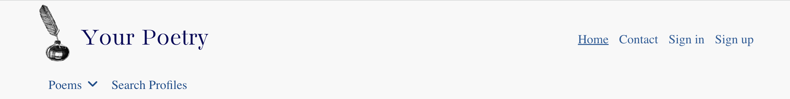
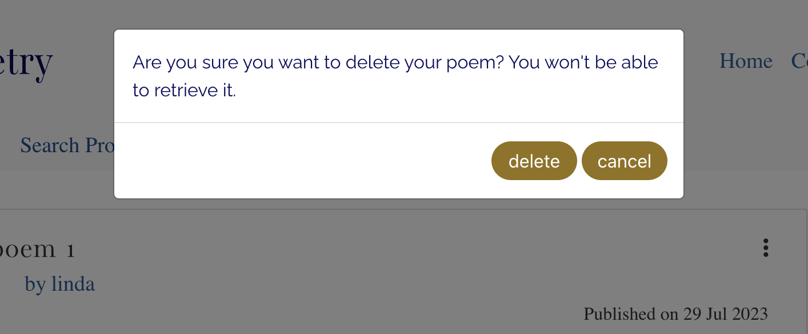

# Your Poetry

詩をシェアするアプリ。
デプロイしたアプリは[こちら](https://yourpoetry.up.railway.app/).

## 目的

ユーザーは詩を書いて投稿できます。他ユーザーからコメントをもらうことができます。
好きな詩を「いいね」したり、プロフィールをフォローすることもできます。

## 使用した言語、フレームワーク、ライブラリ

JavaScript, HTML/CSS, React, React-Bootstrap

- 私が作成した Django Rest Framework の API を利用しました。 
  https://github.com/rkyzk/drf_api2023 
  デプロイした API: 
  https://drf-api-poetry.up.railway.app/

##　本アプリ作成にあたって参考にした資料

- コードインステュート教材の「Moments」 
  https://github.com/Code-Institute-Solutions/moments/tree/a6d063e846e748d68b203b7d8f2d76068a1ccb4a

## Readme

https://github.com/rkyzk/poetry-2023/tree/main

## テスト

https://github.com/rkyzk/poetry-2023/blob/main/public/documents/MANUALTESTS.md

---

# Your Poetry

## CONTENTS

- [Overview](#overview)
- [User Stories](#user-stories)
- [Features in Nutshell](#features-in-a-nutshell)
- [Wireframes](#wireframes)
- [Notes on the Design](#notes-on-the-design)
- [Main Technologies Used](#main-technologies-used)
- [Each Part and Function in Detail](#each-part-and-function-in-detail)
- [Installed Libraries and Dependencies](#installed-libraries-and-dependencies)
- [Notes on Reuse of Components](#notes-on-reuse-of-components)
- [Deployment Process](#depoyment-process)
- [Manual Testing](#manual-testing)
- [Bugs](#bugs)
- [Performance and Accessibility](#performance-and-accessibility)
- [Validating CSS, Html code with Tools](#validating-css-html-code-with-tools)
- [Aspects to be improved in the future](#aspects-to-be-improved-in-the-future)
- [Media](#media)
- [Credits](#credits)

---

The deployed app can be found [here](https://yourpoetry.up.railway.app/).

## Overview

Your Poetry offers an interactive platform where users can share their poems and give/get comments on each other’s poems. The app is equipped with various features including liking/unliking poems, following/unfollowing profiles as well as searching poems/profiles. In addition users can also make their own profiles to let others know a few things about themselves. The purpose of the app is to offer users opportunities to be creative, to share their art and to inspire others.

For this application, I used the following API built using Django REST Framework. 
https://github.com/rkyzk/drf_api2023

## User Stories

User stories can be found [here](https://github.com/users/rkyzk/projects/6/views/1).

## Features in a Nutshell

In this app users can:

- Sign up for membership
- Sign in to have access to full features/sign out
- Edit one's own profile
- Write, update and delete poems
- Write, update and delete comments on poems
- Like/unlike poems
- Follow/unfollow profiles
- Look at various lists of poems such as recently published poems, popular poems, one's own poems and the poems they've liked
- Look at a list of profiles they've followed.
- Search poems and profiles

## Wireframes

Wireframes for this application can be found [here.](https://wireframe.cc/pro/pp/8521443d2672331)
Please click on "Homepage" in the upper left corner to see wireframes of different pages.

## Notes on the Design

**Fonts**

- For the website title and the headings of the pages, I used ‘Bacasime Antique.’
- For navigation links, labels for input boxes and the contents of poems, I used 'Nanum Myeongj.'
- I chose these two fonts because they both look artistic.
- For the introductory paragraph I used ‘Raleway’ since this font is readable and offers a friendly ambient.

**Colors**

Overall I wanted the website to appear simple, elegant and original. 
I used following colors in different sections:

- Background of navigation bars: light gray, #f8f8f8
- Text color: dark blue, rgb(51, 93, 151)
- Most buttons: olive, #8d7326;
- follow button: black, #242a3d
- unfollow button: rgb(189, 218, 243)
- Footer: dark blue, rgb(13, 13, 70)

I used dark blue for the text, instead of very commonly used black or dark gray in order to provide originality. 
I used light gray for the background of navigation bars to keep the appearance simple. 
I used olive color for most buttons, because the color provides a nice contrast to the dark blue. 

**Logo**

As the logo, I chose a drawing of a quill pen and ink, which suits the website's theme.

**Favicon**

I chose a feather icon for the favicon that looks like a quill pen, which is associated with poetry.

## Main Technologies Used

- HTML, CSS, JavaScript
- React.js
- Bootstrap.js

## Each Part and Function in Detail

**Logo**

- The logo is placed at the top left corner of the page, and it links to the home page.

**Navigation Bars**

_Navigation Bar at the top right_

- For logged out users the navigation bar displays links to “Home”, “Contact”, “Sign in” and “Sign out” pages.
- For logged in users, the avatar and the logged in user’s name are displayed in place of “Sign in” and “Sign up.”
- Clicking the username shows a dropdown menu for “My Profile”, “My Poems”, “Poets I’m following”, “Poems I like” and “Sign out”.
- I placed links to poems lists and a profile list that are specific to the current user in the top right dropdown menu. I placed links to other lists that are common to all users such as “New Poems” and “Popular poems” in the navigation bar on the left side.

_Navigation Bar at the top left_

- The second navigation bar is displayed on all pages except for sign in and sign up pages. (Users trying to sign in or sign up will not need this navigation bar.)
- For logged out users, a dropdown menu “Poems” and a link “Search Profiles” are displayed.
- For logged in users, the link to “Write Poems” will be displayed as well. This is hidden for logged out users because only logged in users can write poems.
- Clicking the dropdown menu “Poems” will show links to “New Poems”, “Popular Poems”, “Poems by Categories” and “Search” pages.

_Notes about both navigation bars_

- Both navigation bars will be replaced by burger menus for screen sizes below 768px.
- The names of all links clearly indicate what the destination pages are about, making it easy for users to navigate through the app.

**Footer**

- Footer has a dark blue color that matches the color of the text in the app to establish unity in the appearance.
- Footer offers links to facebook, twitter and Instagram pages.

**The Poem component**

- The poem component displays the title, the author, published date, excerpt (the first 60 characters of the content), likes count and comments count of the poem.
- Users can click the title to go to the individual poem page that displays the full content.
- On the individual poem page, if the user is the writer of the poem, three dots will appear at the top right corner of the component. Clicking the three dots will show options for editing and deleting the poem.
- Clicking the name of the author will redirect users to the profile page of the author.
- If users are logged in they can click the heart icon to like the poem. Clicking again will unlike the poem. The color of the heart is transparent if the user hasn’t liked the poem, and it will be pink otherwise.
- If the user is the writer of the poem, a tooltip will show up when the user hovers over the heart icon and says ‘You can’t like your own poem!’
- If users are not logged in, a tooltip will say ‘Log in to like poems!’ when they hover over the heart icon.
- Clicking the comment icon will redirect users to the individual poem page, so they can leave comments if they are logged in.

**The Profile component**

- The profile component displays the avatar, display name, the date joined, the number of poems written and number of followers. On the individual profile page, an introduction written by the owner (about_me) and their favorite poems and poets (‘favorites’ field) will be displayed as well.
- If users are logged in, follow/unfollow button will be displayed.
- If the user is the owner of the profile, a tag saying ‘You!’ will be displayed.

**Home**

- An introduction explains what the page is for and encourages users to become a member in a friendly and concise manner.
- Featured poems are presented right below the introduction.
- The editors of the site can select featured poems every week or 2 weeks or so and set the featured flag of the poems to true.
- It is important to present featured poems on “Home,” so editors can direct users to read well written poems when they land on the page, which will give them a good first impression of the site.
- Featured profiles are presented on the right column for large screen sizes. For screen sizes below 768px, the profiles are displayed at the top center.
- Every week (or at any time intervals) three featured profiles can be selected by editors of the page and set the featured flag of the profiles to true.

**Contact**

- Contact page provides the email address of the admin, so users can write to the owner of the site.

**New Poems**

- The page lists poems published in the previous 14 days.

**Popular Poems**

- The page lists poems published in the past 30 days ordered by descending likes count. (The poems with the highest number of likes will be displayed at the top.)

**Poems by Categories**

- Poems are categorized under different themes--nature, love, people, humor, haiku and other. Users can choose a category to get a list of poems in that category.

**Search Poems**

- Users can search poems by entering title, author, keyword, category and/or published date range.
- Title, author, keyword will search poems that contain the phrase entered by users (not exact match). The search is case insensitive.

**Write Poems**

- Logged in users can write new poems.
- The title and the content are required fields, and the category will be set ‘other’ unless the users select another category.
- If users try to submit a poem without either or both required fields, the validation message will tell the field may not be blank.
- Users can publish the poem, or save the draft without publishing it.
- All poems written by the user (including unpublished poems) can be found on “My Poems” page.

**Edit Poems**

- On the individual poems page, clicking the three dots and clicking the edit icon will redirect users to “Revise poems” page.
- The saved data for the title, content and category will be displayed on the page, and the user can update them.
- Clicking ‘cancel’ will abort editing and redirect users to the previous page.
- Clicking ‘save’ will save the changes.
- If the user hasn’t published the poem, ‘publish’ button will be displayed.

**Delete Poems (No page)**

- If users wish to delete their poem, they can click the three dots on the individual poem page and click the trash bin icon.
- A confirmation modal will be displayed, and the user can choose to delete or cancel.
- Deleting the poem will remove the data from the backend.

**Search Profiles**

- Users can enter a name of the profile and profiles that match will be displayed.
- The search will start to run one second after the user has stopped typing. (Otherwise the screen will keep flashing while users type letters.)
- The search will look for profiles with display names that contain the phrase entered by the users.
- The search is case insensitive.

**My Profile**

- The page displays the profile and the poems written by the user.
- Three dots will be displayed at the top right corner of the profile.
- Clicking on the three dots will show options to edit profile, to change username and to change password.

**Edit Profile**

- Users can update their display name, introduction about themselves, their favorite poems and poets as well as the profile image.
- Profile image has to be less than 800KB in size. The height and width need to be less than 1000px. Otherwise errors will be raised.

**Change username and password**

- In order to change the username or password, users can click the three dots on their profile page, select an option.
- They can enter their new username or password and save the data.

**My Poems**

- The page shows a list of poems written by the user.

**Poets I’m following**

- The page shows a list of profiles that the user is following.

**Poems I like**

- The page shows a list of poems the user has liked.

**Sign out (No page)**

- Clicking 'Sign out' from the dropdown menu will sing out the user.

## Installed Libraries and Dependencies

- react-bootstrap@1.6.3 bootstrap@4.6.0 were installed to make styling easier.
- react-router-dom@5.3.0 was installed to facilitate component-based routing.
- axios was installed as means to send requests to and get responses from the API.
- react-infinite-scroll-component was installed to implement infinite scroll functionality in displaying lists of poems and profiles.
- jwt-decode was installed so that the timestamp within the response can be accessed.
  The timestamp for when the user logged in can be stored in the local storage, and this information is used to know if it’s appropriate to request a token refresh.

## Notes on Reuse of Components

Following components were used multiple times in the app.

| Components               | In which components, or on which pages are they used?                                    |
| :----------------------- | :--------------------------------------------------------------------------------------- |
| Asset.js                 | PoemPage.js, PoemsPage.js, FeaturedProfiles.js, ProfilePage.js, ProfilesPage.js          |
| Avatar.js                | Profile.js, NavBar.js, Comment.js, FeaturedProfiles.js                                   |
| FooterComponent.js       | Appears on all pages                                                                     |
| MoreDropdown.js          | Profile.js, Poem.js, Comment.js                                                          |
| NavBar.js                | Appears on all pages                                                                     |
| NavBarSecond.js          | Appears on all pages except for sign-in and sign-up pages                                |
| Comment.js               | PoemPage.js                                                                              |
| Poem.js                  | PoemPage.js, Poems.js, ProfilePage.js, Home.js, SearchPoems.js, PoemsPageWithProfiles.js |
| PoemsPage.js             | Home.js, PoemsPageWithProfiles.js, PoemsByCategories.js, SearchPoems.js, ProfilePage.js  |
| PoemsPageWithProfiles.js | NewPoems.js, PopularPoems.js                                                             |

## Depoyment Process

1. Remove ReactStrictMode components from index.js.
2. Make sure in package.json file, in the “scripts” section, the following prebuild command is written: 
   `"heroku-prebuild": "npm install -g serve",`
3. Add Procfile and write `web: serve -s build`
4. Create a new app on Heroku. On the Deploy tab, connect to this repository ‘your-poetry’ through Github.
5. At the bottom of the page, click ‘deploy branch’
6. After the app is successfully deployed, click “View” and get the URL of the app.
7. Go to Dashboard, select the app of the DRF API and open the Settings tab.
8. Add two Config Vars:

- CLIENT_DEV_ORIGIN = the URL of this app in development
- CLIENT_ORIGIN = the URL of the app deployed on Heroku. Deploy again the API project.

## Manual Testing

Manual tests for this applicatio is documented [here](./public/documents/MANUALTESTS.md)

## Bugs

1. In the manual test 'Featured Profiles component' section, test no. 6 failed.
   When a user, who is featured, writes a new poem, the poem count in the featured profile was not updated. (It was updated only after refreshing the page.)

Solution: I added handlePoemCount function in PoemCreateForm which adjusts the poem count in the featured profile if a featured user writes a new poem. I found that when a featured user deletes a poem, the poem count was also not reflected. I added subtractOneFromPoemsCount function in ConfirmationModal.js to adjust the poem count in case a featured user deletes a poem.

2. On Search Profiles Page, when a user enters spaces, the search used to start running, which is not necessary.

Solution: I added line 27 in function 'timer' in useEffect in SearchProfiles so the search will not be run if only spaces are entered.

3. I got an error message in the console saying that a unique ID is needed for each child component of profiles in the FeaturedProfiles.js.

Solution: I had key={profile.id} in the 'Profile' tag line 31 in FeaturedProfiles.js, but this should’ve been in the outermost element in the map function, 'Col' on line 30. I moved the code snippet key={profile.id} into ‘Col’ element, and the error was resolved.

## Performance and Accessibility

**Performance**

Performace for most pages scored in the mid 80s even though I cleared browser cache before testing and ran tests in incognito mode. The major factors that were delaying the page load were that I was importing bootstrap and google fonts. I tried deferring loading these CSS, but the score didn’t improve, so I removed the code to defer loading the CSS. I will take a closer look in the future to improve the page loading speed.

**Accessibility**

Accessibility scored 82 for "Home" at first.
I corrected the following points as suggested in the report.

1. **Background and foreground colors do not have a sufficient contrast ratio.** 
   Both dropdown titles, the username next to the avatar and 'Poems,' didn't have enough contrast against the background. I changed the colors to dark blue.

2. **Links do not have a discernible name.** 
   I added aria-label for the link on the comment icon.

3. **Lists do not contain only <li> elements and script supporting elements "script" and "template".** 
   In the Footer Component, I added list tags around anchor tags.

4. **Heading elements are not in a sequentially-descending order.** 
   I was using h1, h2 and h4. So I replaced h4 with h3.

- After the above corrections were made, accessibility scored 100 for all pages.

The screenshots of the results can be found [here](./Lighthouse.md).

### Checking html and css

No errors were found in the html and css by validation tools at following sites: 
https://validator.w3.org/ 
https://jigsaw.w3.org/

## Aspects to be improved in the future

1. When the dropdown menu in the navigation, (the username next to Avatar when the user is logged in) is clicked, the menu first appears briefly on the left side of the dropdown title and disppears, and the menu reappears below the dropdown title. Similarly, the dropdown menu titled ‘Poems’ in the navigation on the left side also appears on the right side and reappears at below the title. I need to find a way to let the menus appear at the intended positions from the beginning.

2. On "Popular Poems" page, if the user ‘likes’ a poem, and if the poems will be rearranged due to the new likes count, the rearrangement happens in a manner that it’s difficult for the user to know where the poem they’ve just liked has been moved to. I need to make it easier for the user to follow where the poem has been replaced.

3. As discussed in the 'Performance and Accessibility' section, the performance needs to be improved.

### Media

The favicon was taken from https://icons8.com/icons/set/feather. 
The logo was taken from https://www.freepik.com/free-vector/hand-drawn-quill-isolated-white-background_2782976.htm#query=quill%20pen%20and%20ink&position=25&from_view=search&track=ais

I used fonts from Google fonts and icons from Fontawesome.

### Credits

Many thanks to my mentor Jubril Akolade and tutors at CI for their dedicated guidance and support.

I learned the methods used in this project from the walk-through project at CI, 'Moments'. 
https://github.com/Code-Institute-Solutions/moments/tree/a6d063e846e748d68b203b7d8f2d76068a1ccb4a
